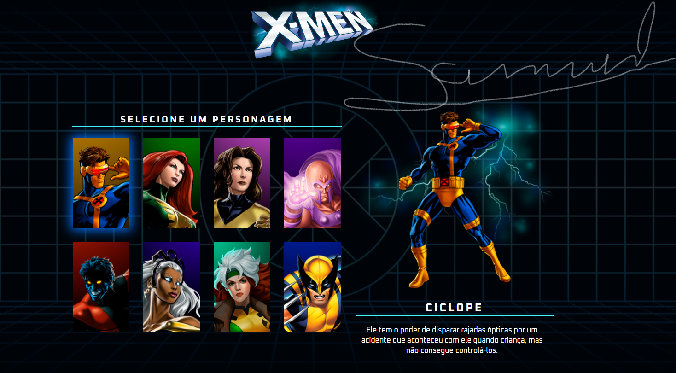

<h1 align="center"> X-men(escolha seu personagem)</h1>

Projeto recriado junto ao canal DevemDobro,através das suas lives no youtube

  <a href="#-tecnologias">Tecnologias</a>&nbsp;&nbsp;&nbsp;|&nbsp;&nbsp;&nbsp;
  <a href="#-projeto">Projeto</a>&nbsp;&nbsp;&nbsp;|&nbsp;&nbsp;&nbsp;
  <a href="#-layout">Layout</a>&nbsp;&nbsp;&nbsp;|&nbsp;&nbsp;&nbsp;

 

  

## 💡 Tecnologias

Esse projeto foi desenvolvido com as seguintes tecnologias:

- HTML e CSS;
- JavaScript;
- Git e Github;
- Figma;

## 💻 Projeto

Projeto para mostrar os personagem do X-men e suas descrições.💥✖

## 🔖 Layout

Você pode visualizar o layout do projeto através [DESSE LINK](https://www.figma.com/file/pcXaFvQGmgvIVwTAtfbzCc/Dev-em-Dobro?type=design&node-id=50-1149&mode=design&t=y2LuzCyiJSeJ2k48-0).

